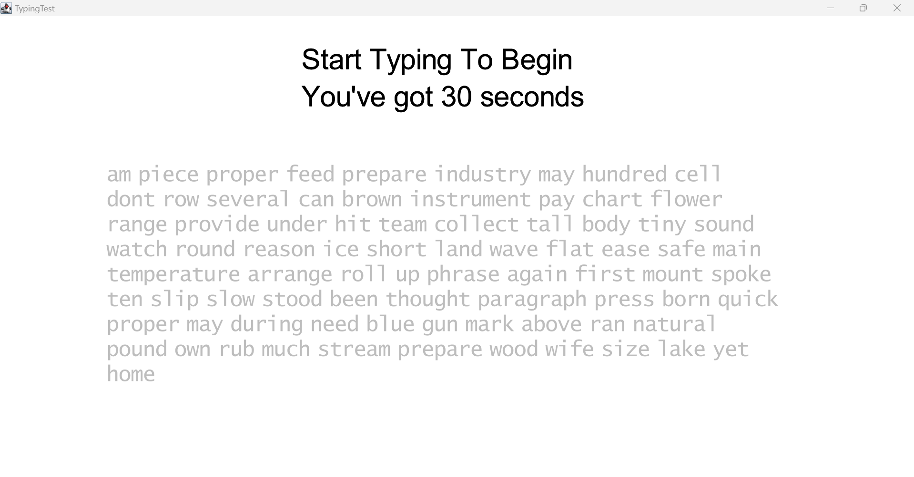

# TypingTest
###### Members: Kien Nguyen, Daniel Seo 

## Project Description
Our project is a typing test that is visually aesthetic and simple, calculating the users WPM, accuracy rates, and character count. Our code requires users to install Java 17 in order to use kilt-graphics, a graphic library developed by the Mathematics, Statistics, and Computer Science (MSCS) department in Macalester College: https://mac-comp127.github.io/kilt-graphics/index.html. It is written to run on Visual Studio Code.

Our Utils class is adapted from Homework 2: Language Detector for COMP 128, created by Macalester's MSCS Department Faculty: Bret Jackson and Shilad Sen

Our dictionary.txt, used to generate our typing text, is adapted from https://gist.github.com/deekayen/4148741 by deekayen. 

To run the program, the user should run the main method in the typingTest class. This is the main class that creates the user interface. The game starts whenever the user starts typing, counting down 30 seconds. As the user types, the letters on screen will turn green if it is typed correctly, and red if it is typed wrongly. The user can press Backspace to revert the previous letter, giving them a chance to fix previous mistakes. Once the timer finishes counting down, the game will display the user's word count, WPM, character count and accuracy. Now that the game has ended, the gaem will not respond to any more typing from the user. The user can then press Space to restart the game, restarting the 30 seconds timer with a different text each time and new internal data.

## Known Issue
The cursor still animates once the game has ended. Our typing text only includes lowercase letters with no punctuations. 
